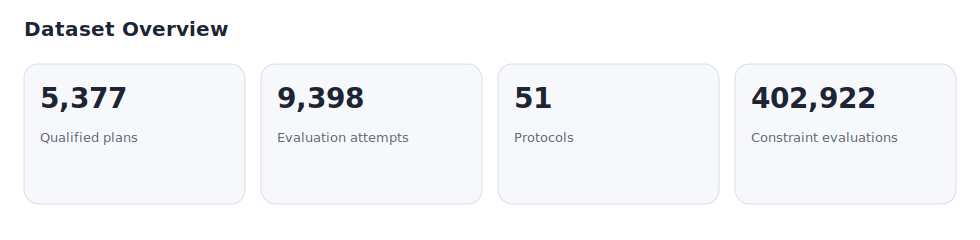
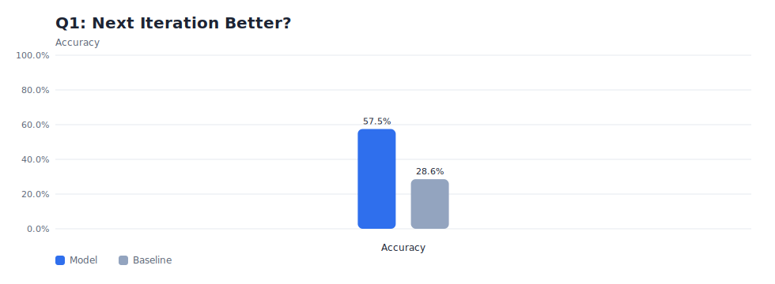
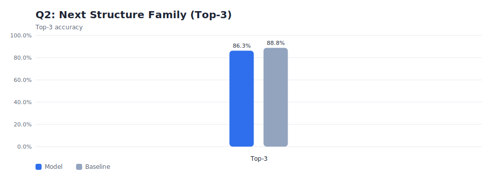
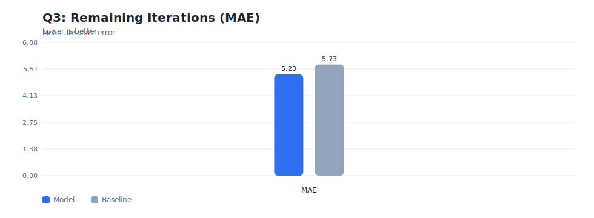
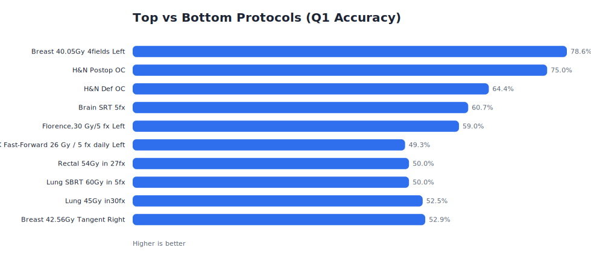

# Planning Trajectory Learning

This project analyzes DVH-based plan evaluations to understand how plan quality evolves across iterative planning. It builds a local dataset from MongoDB (read-only), trains protocol-specific models, and serves a dashboard that summarizes results for AAPM-style abstracts.

## What this repository does

- Curates plan evaluation trajectories (multiple attempts per plan, final approved plans only).
- Builds protocol-specific population distributions and plan scores.
- Trains models to predict planning decisions and next-step improvements.
- Provides a local dashboard for review, plots, and abstract figures.

## Project at a Glance (auto-generated)

<!-- AUTO-GLANCE:START -->
- Dataset: 5,377 approved plans, 9,398 evaluation attempts, 51 protocols.
- Q1 (next iteration better): 57.5% accuracy (baseline 28.6%).
- Q2 (next structure family): 86.3% top-3 accuracy.
- Q3 (remaining iterations): MAE 5.23 (baseline 5.73).
<!-- AUTO-GLANCE:END -->

## Quickstart (student)

1) Install dependencies:

```
pip install -r requirements.txt
```

2) Add the read-only MongoDB URI:

```
cp .env.template .env
```

3) Run the pipeline (reads MongoDB, writes local files only):

```
./scripts/run_pipeline.sh
```

4) Start the dashboard:

```
python3 src/dashboard/app.py
```

5) Update this README snapshot after reruns:

```
python3 scripts/update_readme.py
```

## Latest Dashboard Snapshot (auto-generated)

<!-- AUTO-SNAPSHOT:START -->
Last refreshed: 2025-12-29 15:41:42 UTC

Dataset (Phase 2)
- Qualified plans: 5,377
- Evaluation attempts: 9,398
- Protocols observed: 51
- Minimum coverage: 65.0%
- Minimum attempts: 2
- Plateau delta: 2.0

Modeling (Phase 3, macro averages)
- Q1: Next iteration better? accuracy 57.5% (baseline 28.6%), AUC 0.62
- Q2: Which structure family improves next? top-1 51.9%, top-3 86.3%, top-5 94.9%
- Q3: Remaining iterations (MAE) 5.23 (baseline 5.73)
- Stop/continue classifier (alternate): accuracy 75.7%, balanced 61.6%, AUC 0.66

Model configuration
- Protocols modeled: 23
- Minimum plans per protocol: 20
- Train/val/test split: 0.7/0.1/0.2 (seed 42)

Top protocols by plan count (modeled)
- Prostate 70Gy in 28fx: 223 plans
- Breast 42.56Gy Tangent Right: 158 plans
- Lung 45Gy in30fx: 97 plans
- UK Fast-Forward  26 Gy / 5 fx daily Left: 94 plans
- Brain SRS 1fx: 78 plans

Note: values are aggregated; no patient identifiers are included.
<!-- AUTO-SNAPSHOT:END -->

## Draft Abstract (auto-generated)

<!-- AUTO-ABSTRACT:START -->
# Draft Abstract - PlanEval Trajectory Learning

**Title:** Protocol-specific planning trajectories for decision support in radiotherapy plan optimization

**Purpose:** During treatment planning, planners perform repeated DVH-based evaluations to judge whether a plan is improving, identify remaining tradeoffs, and decide when acceptable quality has been reached. This study evaluates whether DVH evaluations collected during real iterative planning contain sufficient signal to predict expert planning decisions at the next iteration, enabling protocol-specific plan quality prediction and decision support.

**Methods:** DVH evaluation data were retrospectively curated from an institutional plan evaluation system, capturing the iterative assessments performed by planners during treatment planning. A total of 5,377 clinically approved plans (9,398 evaluation attempts) spanning 51 protocols were included, requiring at least two evaluations per plan and a final approved state with minimum coverage of 65%. Across all iterations, 402,922 constraint evaluations covering 150 unique structures were analyzed. A composite plan score was derived exclusively from approved plan evaluations and used only as a reference for defining protocol-specific quality targets. Intermediate DVH evaluations from earlier planning iterations were used to construct per-iteration feature representations summarizing constraint satisfaction, coverage, and violation severity. For protocols with at least 20 plans (23 protocols), plan-level 70/10/20 train/validation/test splits were used to train models to answer three planning questions: (1) whether the next planner iteration would improve plan quality relative to the current iteration, using chronological order as a proxy label; (2) which structure family was most likely to improve next; and (3) whether additional iterations were likely to yield meaningful improvement (stop versus continue). A secondary analysis estimated remaining iterations to approval.

**Results:** The improvement-direction model correctly identified the next iteration as better or worse with 57.5% accuracy versus a 28.6% baseline (AUC 0.62); top-5 protocols averaged 67.6% vs 50.9% for the bottom-5. The stop/continue model achieved 61.6% balanced accuracy versus a 52.2% baseline (AUC 0.66); top-5 protocols averaged 82.9% vs 45.5% for the bottom-5. Mean absolute error for remaining-iteration prediction was 5.23 iterations (baseline 5.73). Next-focus prediction included the observed improvement within the top three suggested structure families in 86.3% of cases (top five: 94.9%); top-5 protocols averaged 100% vs 71.3% for the bottom-5, with lower balanced accuracy (25.1% vs baseline 26.9%) due to label imbalance. Highest-signal protocols included brain SRT (3–5 fx), head and neck oral cavity, breast tangents, and lung SBRT 54Gy/3fx, while rectal 54Gy and lung 45–60Gy protocols showed lower predictability.

**Conclusion:** DVH evaluations collected during real iterative planning encode reproducible, protocol-specific signals that predict how expert planners improve plans and determine when planning should stop. This work demonstrates the feasibility of a plan quality prediction and decision-support framework that can assist planners directly and provide clinically grounded context for automated and AI-driven planning systems.
<!-- AUTO-ABSTRACT:END -->

## Data safety

- The code only reads from MongoDB. All outputs are written locally under `data/derived/`.
- `.gitignore` blocks derived data and CSV exports from being committed.
- README snapshots include only aggregated counts and metrics.

## Docs

- `docs/student_guide.md` - step-by-step workflow for new students
- `docs/data_dictionary.md` - CSV column definitions
- `docs/dashboard.md` - how to run and use the dashboard
- `docs/troubleshooting.md` - common issues and fixes
- `docs/handoff_checklist.md` - checklist for supervising handoffs
- `docs/sample_data/` - non-PHI sample exports

## Key scripts

- `scripts/run_pipeline.sh` - run Phase 2/3 pipeline locally
- `scripts/export_csv.py` - export local CSV snapshots for review
- `scripts/update_readme.py` - refresh README snapshot + abstract text
- `scripts/render_figures.py` - render README figures from derived metrics

## Figures (auto-generated)

Run `python3 scripts/render_figures.py` to refresh these images.






